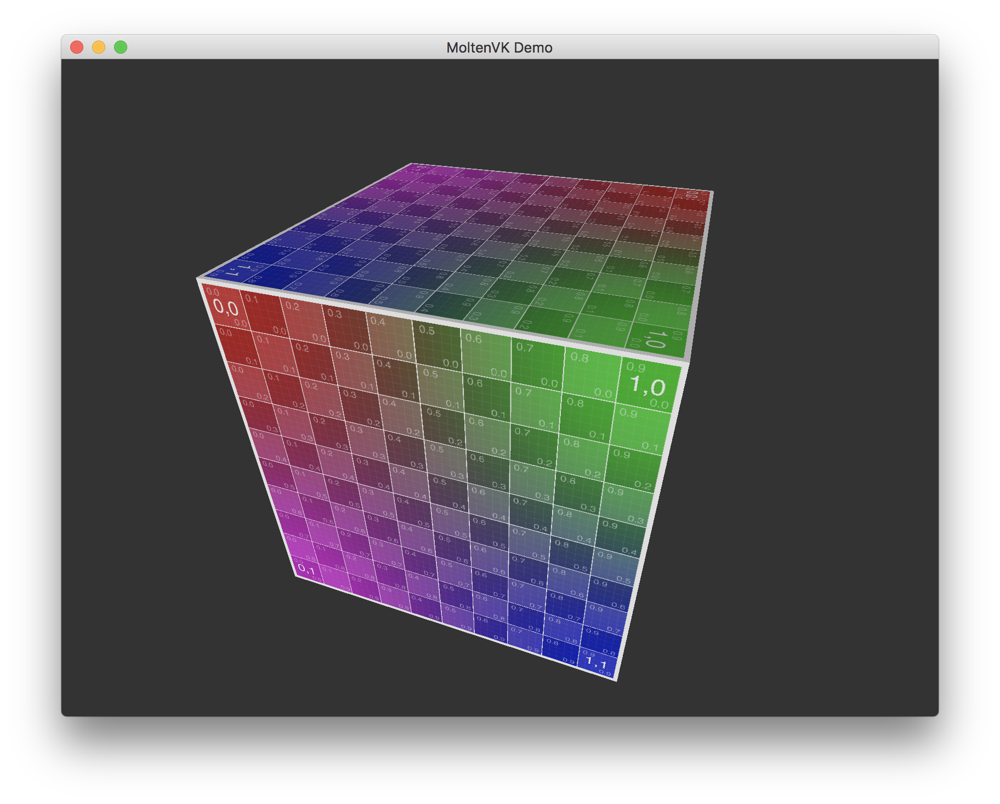

# HelloVulkanMac

This project is a sample showing how to incorporate the MoltenVK SDK in your project in order to use the Vulkan API on macOS.

## Using this Project

To compile this project, you will need a copy of the MoltenVK Vulkan SDK, available at [LunarG's SDK site](https://vulkan.lunarg.com/sdk/home). **These files are not included in the repository, but are required to build the target.**

  - Download the Mac SDK from the site, or visit this [direct link](https://sdk.lunarg.com/sdk/download/1.0.69.0/mac/vulkansdk-macos-1.0.69.0.tar.gz?u=).
  - Decompress the archive (vulkansdk-macos-1.0.69.0.tar) to the directory of the same name in the project root.
  - Build and run
  
  The Xcode project assumes version 1.0.69 of the API/SDK. If you are using a newer version of the SDK, you will need to fix up some paths in the project settings:

  - Point the `HEADER_SEARCH_PATHS` to the `macOS/include` path in the SDK directory  
  - Point the `LIBRARY_SEARCH_PATHS` to the `MoltenVK/macOS` path in the SDK directory

If you get an error stating "'vulkan/vulkan.h' file not found", the SDK is not correctly installed.

This project embeds the MoltenVK runtime as a dylib. In order to link against a system copy of MoltenVK, you will need to modify the project configuration. These modifications are beyond the scope of this sample.

For more information on using MoltenVK in your own projects, visit [its repository](https://github.com/KhronosGroup/MoltenVK).
